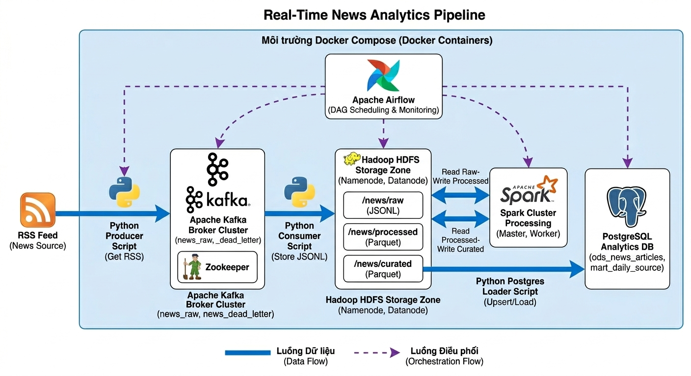

# Real-Time News Ingestion Pipeline

## Thành viên nhóm: 
- 3123580051 - Phạm Hoàng Tiến
- 3123580046 - Thạch Ngọc Thảo
- 3123580058 - Nguyễn Thái Tú


---- Bài tập nhóm môn Big Data ----

Giảng viên hướng dẫn: TS. Vũ Ngọc Thanh Sang

--------------------------------------
This repository is organized around the Big Data MVP:

`RSS -> Kafka -> HDFS raw -> Spark processed -> Spark curated -> Spark keywords`

Airflow orchestration is implemented as an optional Docker Compose profile on top of the working MVP stack.

## Target Environment

Use `WSL/Linux + Docker Desktop`.

- Run Python from WSL or a Linux shell.
- Run infrastructure with `docker compose`.
- Keep one Linux virtual environment for the app code.

## Project Layout

```text
.
|- docker-compose.yml
|- requirements.txt
|- requirements-airflow.txt
|- requirements-dashboard.txt
|- Dockerfile.streamlit
|- producer/
|- consumer/
|- common/
|- config/
|- dashboard/
|- dags/
|- scripts/
|- tests/
|- Spark_jobs/
|- data/
`- docs/
```

## Architecture Components



## Services in Docker Compose

The core stack includes:

- `zookeeper`
- `kafka`
- `namenode`
- `datanode`

The optional `airflow` profile adds:

- `postgres`
- `postgres-analytics`
- `airflow-init`
- `airflow-webserver`
- `airflow-scheduler`

The optional `dashboard` profile adds:

- `streamlit-dashboard`

### Dashboard Refresh

The Streamlit dashboard can trigger a manual Airflow DAG run for `news_pipeline`.

Required environment variables for the refresh button:

- `AIRFLOW_API_URL`
- `AIRFLOW_USERNAME`
- `AIRFLOW_PASSWORD`
- `APP_TIMEZONE` (defaults to `Asia/Bangkok`)

Exposed ports:

- Kafka external listener: `localhost:9093`
- Kafka internal listener: `kafka:29092`
- NameNode UI: `localhost:9870`
- NameNode RPC: `localhost:9000`
- DataNode UI: `localhost:9864`
- Analytics PostgreSQL: `localhost:5433` when the `airflow` profile is enabled
- Airflow UI: `localhost:8080` when the `airflow` profile is enabled
- Streamlit UI: `localhost:8501` when the `dashboard` profile is enabled

## Setup in WSL/Linux

Create and activate a virtual environment:

```bash
python3 -m venv ~/venvs/sgu25_bigdata
source ~/venvs/sgu25_bigdata/bin/activate
python -m pip install --upgrade pip
python -m pip install -r requirements.txt
```

Using a venv inside `/mnt/d/...` can fail on WSL because `ensurepip` is unreliable on mounted Windows paths. A Linux-home venv such as `~/venvs/sgu25_bigdata` is the recommended setup for this repo.

If your shell does not expose `python`, use `python3` instead. The provided shell scripts auto-detect `python` or `python3`.

Phase 1 adds a local PySpark transform step, so Java 17 must also be available when you run the transform outside Docker.

Spark jobs now read from and write to HDFS directly through the NameNode RPC endpoint. If you need to override the default, set `HDFS_DEFAULT_FS` explicitly:

```bash
export HDFS_DEFAULT_FS=hdfs://localhost:9000
```

Start the core infrastructure:

```bash
docker compose up -d
```

If you previously ran an older Kafka/ZooKeeper stack on `9092` or `2181`, stop it first or keep it isolated. This compose file now exposes Kafka on `9093` and does not publish ZooKeeper to the host.

When you enable Airflow in Docker, allocate at least 4 GB of Docker memory. The official Airflow Docker guide warns that lower memory often causes unstable startup.

Create the Kafka topic:

```bash
bash scripts/init_kafka_topics.sh
```

This creates:

- `news_raw`
- `news_dead_letter`

## Run the Core Pipeline

Run the full end-to-end demo (one command):

```bash
bash scripts/demo_end_to_end.sh
```

This command starts Docker services, ensures Kafka topics, runs the pipeline (`RSS -> Kafka -> HDFS raw -> Spark processed -> Spark curated -> Spark keywords`), loads curated and keyword data into PostgreSQL analytics, and prints summary outputs.

Publish RSS items into Kafka:

```bash
python -m producer.run_producer
```

Producer and consumer startup now wait briefly for Kafka readiness. You can tune that behavior with:

```bash
export KAFKA_STARTUP_TIMEOUT_SECONDS=90
export KAFKA_STARTUP_CHECK_INTERVAL_SECONDS=3
```

The demo and smoke-test shell scripts also wait for the external Kafka listener on `localhost:9093` before starting local Python producer and consumer steps. You can override that check with:

```bash
export KAFKA_WAIT_HOST=localhost
export KAFKA_WAIT_PORT=9093
```

Consume Kafka messages and write them to HDFS raw storage:

```bash
python -m consumer.kafka_consumer_to_hdfs --max-messages 50
```

The default consumer group is `news-raw-to-hdfs-v1` locally and `news-raw-to-hdfs-airflow` in Docker Airflow.

If you want a fresh consumer group to skip historical Kafka backlog and only read new messages, run:

```bash
python -m consumer.kafka_consumer_to_hdfs --max-messages 50 --auto-offset-reset latest
```

The Airflow profile is configured with `KAFKA_AUTO_OFFSET_RESET=latest`, and the DAG explicitly passes `--auto-offset-reset latest`, so new Airflow deployments consume only new Kafka messages by default.

When the consumer runs from WSL/local and `HDFS_URL` points to `localhost`, it automatically rewrites WebHDFS redirects back to `localhost` so it can upload to the exposed DataNode port.

Transform the latest raw file into processed Parquet:

```bash
python -m Spark_jobs.transform_news_raw_to_processed --input-path /news/raw --output-path /news/processed
```

Validate HDFS output:

```bash
python -m scripts.validate_hdfs_output --path /news/raw
```

Validate processed output:

```bash
python -m scripts.validate_processed_output --path /news/processed
```

Curate the latest processed batch into the curated zone:

```bash
python -m Spark_jobs.curate_news_processed_to_curated --input-path /news/processed --output-path /news/curated
```

Validate curated output:

```bash
python -m scripts.validate_curated_output --path /news/curated
```

Extract keywords from the latest curated batch:

```bash
python -m Spark_jobs.extract_news_keywords --input-path /news/curated --output-path /news/keywords
```

The keyword extractor now uses:

- `config/keyword_settings.json`
- `config/stopwords_vi.txt`
- `config/source_keyword_blocklist.json`

Each keyword batch also writes `_keyword_metadata.json` with:

- `batch_path`
- `keyword_output_path`
- `keyword_score_version`
- `keyword_config_hash`

Validate keyword output:

```bash
python -m scripts.validate_keyword_output --path /news/keywords
```

Load the latest curated batch into analytics PostgreSQL:

```bash
python -m scripts.load_curated_to_postgres --input-path /news/curated
```

By default this script upserts into:

- `ods_news_articles`
- `mart_news_daily_source`

The loader now tracks a deterministic fingerprint per curated batch in `analytics_load_history`.
If the same `batch_path` is regenerated with different Parquet contents, the loader reloads it instead of silently skipping it.

Load the latest keyword batch into analytics PostgreSQL:

```bash
python -m scripts.load_keywords_to_postgres --input-path /news/keywords
```

By default this script upserts into:

- `mart_article_keywords`
- `mart_keyword_daily_source`

The keyword loader now tracks the latest `keyword_config_hash` per keyword batch path in `analytics_keyword_load_history`. If you rerun the same batch with a different config hash, the loader replaces that batch in PostgreSQL instead of silently skipping it.
The loader also refreshes dashboard-ready PostgreSQL views for Streamlit:

- `vw_streamlit_article_keywords_latest`
- `vw_streamlit_keyword_daily_source_latest`
- `vw_streamlit_keyword_daily_overall_latest`

All downstream batch-oriented jobs also accept `--input-batch-path` when you want to pin an exact upstream batch instead of resolving the latest available one.

View analytics data in PostgreSQL:

```bash
docker compose --profile airflow exec postgres-analytics psql -U analytics -d analytics
```

Run sample queries in `psql`:

```sql
\dt
SELECT * FROM analytics_load_history ORDER BY loaded_at DESC LIMIT 20;
SELECT * FROM analytics_keyword_load_history ORDER BY loaded_at DESC LIMIT 20;
SELECT * FROM ods_news_articles ORDER BY loaded_at DESC LIMIT 20;
SELECT * FROM mart_news_daily_source ORDER BY event_date DESC, source LIMIT 20;
SELECT * FROM mart_article_keywords ORDER BY loaded_at DESC LIMIT 20;
SELECT * FROM mart_keyword_daily_source ORDER BY event_date DESC, source, rank_in_group LIMIT 20;
SELECT * FROM vw_streamlit_keyword_daily_source_latest ORDER BY event_date DESC, source, rank_in_group LIMIT 20;
SELECT * FROM vw_streamlit_keyword_daily_overall_latest ORDER BY event_date DESC, rank_in_day LIMIT 20;
SELECT * FROM vw_streamlit_article_keywords_latest ORDER BY loaded_at DESC, rank_in_article LIMIT 20;
```

## Streamlit-Ready Keyword Views

For a Streamlit dashboard, prefer reading the prepared views instead of querying batch tables directly:

- `vw_streamlit_keyword_daily_source_latest`
  - Use for top keywords by `event_date + source`
- `vw_streamlit_keyword_daily_overall_latest`
  - Use for top keywords by `event_date` across all sources
- `vw_streamlit_article_keywords_latest`
  - Use for per-article keyword candidates

Example queries:

```sql
SELECT event_date, source, keyword, article_count, weighted_score, rank_in_group
FROM vw_streamlit_keyword_daily_source_latest
WHERE event_date = CURRENT_DATE
  AND source = 'VNExpress'
ORDER BY rank_in_group
LIMIT 20;

SELECT event_date, keyword, source_count, article_count, weighted_score, rank_in_day
FROM vw_streamlit_keyword_daily_overall_latest
WHERE event_date >= CURRENT_DATE - INTERVAL '7 days'
ORDER BY event_date DESC, rank_in_day
LIMIT 100;

SELECT source, title, keyword, article_score, rank_in_article
FROM vw_streamlit_article_keywords_latest
WHERE event_date = CURRENT_DATE
ORDER BY source, rank_in_article
LIMIT 100;
```

## Streamlit Dashboard

The repository now includes a Streamlit dashboard at `dashboard/streamlit_app.py`.

Install app dependencies locally:

```bash
python -m pip install -r requirements.txt
python -m pip install -r requirements-dashboard.txt
```

Run the dashboard from WSL/Linux:

```bash
streamlit run dashboard/streamlit_app.py
```

By default the app connects to analytics PostgreSQL with:

- `ANALYTICS_DB_HOST=localhost`
- `ANALYTICS_DB_PORT=5433`
- `ANALYTICS_DB_NAME=analytics`
- `ANALYTICS_DB_USER=analytics`
- `ANALYTICS_DB_PASSWORD=analytics`

You can override these with environment variables or Streamlit secrets:

```toml
[analytics_db]
analytics_db_host = "localhost"
analytics_db_port = "5433"
analytics_db_name = "analytics"
analytics_db_user = "analytics"
analytics_db_password = "analytics"
```

To run the dashboard with Docker Compose:

```bash
docker compose --profile dashboard up -d postgres-analytics streamlit-dashboard
```

If you already have loaded keyword marts, open `http://localhost:8501` and use the prepared tabs:

- `Overall Trends`
- `Source Trends`
- `Article Keywords`
- `Keyword Detail`

The dashboard currently includes:

- daily keyword momentum charts across the selected date range
- a breakout keyword table comparing the latest day with prior history
- source-specific drill-down from source trends to supporting article rows
- cross-source comparison for a selected keyword in the `Keyword Detail` tab
- exact keyword drill-down to supporting article rows from the same dashboard
- CSV export buttons for overall trends, breakout tables, source trends, detail views, and supporting articles
- keyword model/version visibility from PostgreSQL view metadata

You can also export a manual keyword review sample for Phase 3A tuning:

```bash
python -m scripts.export_keyword_review_sample --limit 100
```

Run the full MVP + keyword smoke test:

```bash
bash scripts/test_pipeline.sh
```

Preview the latest HDFS file in a readable format:

```bash
python -m scripts.preview_hdfs_data --path /news/raw --limit 5
```

You can also preview a specific file:

```bash
python -m scripts.preview_hdfs_data --path /news/raw/2026/03/14/news_145545123456.jsonl --limit 3
```

## HDFS Output Layout

The consumer writes raw files under:

```text
/news/raw/YYYY/MM/DD/news_HHMMSSffffff.jsonl
```

The Spark transform writes processed Parquet batches under:

```text
/news/processed/YYYY/MM/DD/news_HHMMSSffffff/
```

The curated job writes analytics-ready Parquet batches under:

```text
/news/curated/YYYY/MM/DD/news_HHMMSSffffff/
```

The keyword extraction job writes keyword analytics batches under:

```text
/news/keywords/YYYY/MM/DD/news_HHMMSSffffff/article_keywords/
/news/keywords/YYYY/MM/DD/news_HHMMSSffffff/keyword_daily_source/
```

See `docs/data_contract.md` for the shared article schema and validation rules.

## Observability And Quality

Core pipeline services now use structured logging via Python `logging` instead of ad-hoc `print`.

Each major step logs stable fields such as:

- `source`
- `topic`
- `row_count`
- `invalid_count`
- `duplicate_count`
- `output_path`
- `duration_ms`

Data quality metrics are logged during producer fetch, Kafka consumption, Spark transforms, and keyword extraction:

- missing `title` count and rate
- missing `link` count and rate
- duplicate record count
- articles by `source`
- warning alert when a configured source returns `0` articles

Kafka messages are now published with the normalized article link as the message key.
Ingress validation is strict: payloads with missing required fields, invalid datetimes, or unexpected contract fields are rejected instead of being silently normalized into valid records.
Invalid consumed messages are routed to the `news_dead_letter` topic with validation errors and payload context.

## Airflow Phase

Airflow now runs as an optional Docker Compose profile on top of the working MVP stack.

Files involved:

- `Dockerfile.airflow`
- `dags/news_pipeline_dag.py`
- `requirements-airflow.txt`
- `scripts/start_airflow.sh`
- `Spark_jobs/transform_news_raw_to_processed.py`
- `Spark_jobs/curate_news_processed_to_curated.py`
- `Spark_jobs/extract_news_keywords.py`
- `scripts/validate_processed_output.py`
- `scripts/validate_curated_output.py`
- `scripts/validate_keyword_output.py`
- `scripts/load_curated_to_postgres.py`
- `scripts/load_keywords_to_postgres.py`
- `sql/analytics_init.sql`

Start Airflow:

```bash
bash scripts/start_airflow.sh
```

Or run the steps manually:

```bash
docker compose up -d
docker compose --profile airflow up airflow-init --build
docker compose --profile airflow up -d airflow-webserver airflow-scheduler
```

Open the UI at `http://localhost:8080`.

Default login:

- username: `airflow`
- password: `airflow`

The DAG runs the same commands you already verified manually, but inside Docker using internal service names:

- Kafka: `kafka:29092`
- HDFS NameNode: `namenode:9870`
- HDFS default FS for Spark: `hdfs://namenode:9000`
- WebHDFS redirect host: `datanode`
- Analytics PostgreSQL: `postgres-analytics:5432`

The current DAG order is now:

```text
fetch_and_publish_articles
  -> consume_kafka_to_raw_zone
  -> transform_raw_to_processed_zone
  -> validate_processed_zone
  -> curate_processed_to_curated_zone
  -> validate_curated_zone
     -> load_curated_to_analytics_db
     -> extract_keywords_from_curated_zone
        -> validate_keyword_zone
        -> load_keywords_to_analytics_db
```
