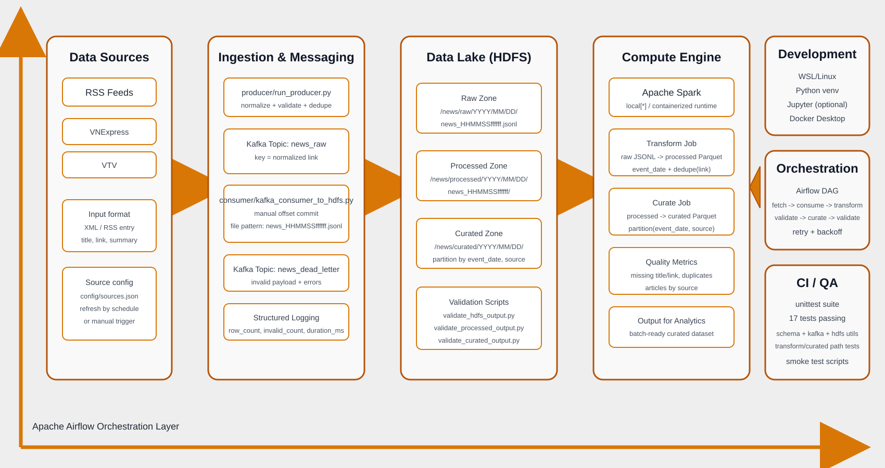

# Real-Time News Ingestion Pipeline

This repository is organized around the Big Data MVP:

`RSS -> Kafka -> HDFS raw -> Spark processed -> Spark curated`

Airflow orchestration is implemented as an optional Docker Compose profile on top of the working MVP stack.

## Target Environment

Use `WSL/Linux + Docker Desktop`.

- Run Python from WSL or a Linux shell.
- Run infrastructure with `docker compose`.
- Keep one Linux virtual environment for the app code.

## Project Layout

```text
.
|- docker-compose.yml
|- requirements.txt
|- requirements-airflow.txt
|- producer/
|- consumer/
|- common/
|- config/
|- dags/
|- scripts/
|- tests/
|- Spark_jobs/
|- data/
`- docs/
```

## Architecture Diagram



## Services in Docker Compose

The core stack includes:

- `zookeeper`
- `kafka`
- `namenode`
- `datanode`

The optional `airflow` profile adds:

- `postgres`
- `airflow-init`
- `airflow-webserver`
- `airflow-scheduler`

Exposed ports:

- Kafka external listener: `localhost:9093`
- Kafka internal listener: `kafka:29092`
- NameNode UI: `localhost:9870`
- NameNode RPC: `localhost:9000`
- DataNode UI: `localhost:9864`
- Airflow UI: `localhost:8080` when the `airflow` profile is enabled

## Setup in WSL/Linux

Create and activate a virtual environment:

```bash
python3 -m venv ~/venvs/sgu25_bigdata
source ~/venvs/sgu25_bigdata/bin/activate
python -m pip install --upgrade pip
python -m pip install -r requirements.txt
```

Using a venv inside `/mnt/d/...` can fail on WSL because `ensurepip` is unreliable on mounted Windows paths. A Linux-home venv such as `~/venvs/sgu25_bigdata` is the recommended setup for this repo.

Phase 1 adds a local PySpark transform step, so Java 17 must also be available when you run the transform outside Docker.

Start the core infrastructure:

```bash
docker compose up -d
```

If you previously ran an older Kafka/ZooKeeper stack on `9092` or `2181`, stop it first or keep it isolated. This compose file now exposes Kafka on `9093` and does not publish ZooKeeper to the host.

When you enable Airflow in Docker, allocate at least 4 GB of Docker memory. The official Airflow Docker guide warns that lower memory often causes unstable startup.

Create the Kafka topic:

```bash
bash scripts/init_kafka_topics.sh
```

This creates:

- `news_raw`
- `news_dead_letter`

## Run the Core Pipeline

Publish RSS items into Kafka:

```bash
python -m producer.run_producer
```

Consume Kafka messages and write them to HDFS raw storage:

```bash
python -m consumer.kafka_consumer_to_hdfs --max-messages 50
```

The default consumer group is `news-raw-to-hdfs-v1` locally and `news-raw-to-hdfs-airflow` in Docker Airflow.

When the consumer runs from WSL/local and `HDFS_URL` points to `localhost`, it automatically rewrites WebHDFS redirects back to `localhost` so it can upload to the exposed DataNode port.

Transform the latest raw file into processed Parquet:

```bash
python -m Spark_jobs.transform_news_raw_to_processed --input-path /news/raw --output-path /news/processed
```

Validate HDFS output:

```bash
python -m scripts.validate_hdfs_output --path /news/raw
```

Validate processed output:

```bash
python -m scripts.validate_processed_output --path /news/processed
```

Curate the latest processed batch into the curated zone:

```bash
python -m Spark_jobs.curate_news_processed_to_curated --input-path /news/processed --output-path /news/curated
```

Validate curated output:

```bash
python -m scripts.validate_curated_output --path /news/curated
```

Run the full MVP smoke test:

```bash
bash scripts/test_pipeline.sh
```

Preview the latest HDFS file in a readable format:

```bash
python -m scripts.preview_hdfs_data --path /news/raw --limit 5
```

You can also preview a specific file:

```bash
python -m scripts.preview_hdfs_data --path /news/raw/2026/03/14/news_145545123456.jsonl --limit 3
```

## HDFS Output Layout

The consumer writes raw files under:

```text
/news/raw/YYYY/MM/DD/news_HHMMSSffffff.jsonl
```

The Spark transform writes processed Parquet batches under:

```text
/news/processed/YYYY/MM/DD/news_HHMMSSffffff/
```

The curated job writes analytics-ready Parquet batches under:

```text
/news/curated/YYYY/MM/DD/news_HHMMSSffffff/
```

See `docs/data_contract.md` for the shared article schema and validation rules.

## Observability And Quality

Core pipeline services now use structured logging via Python `logging` instead of ad-hoc `print`.

Each major step logs stable fields such as:

- `source`
- `topic`
- `row_count`
- `invalid_count`
- `duplicate_count`
- `output_path`
- `duration_ms`

Data quality metrics are logged during producer fetch, Kafka consumption, and Spark transforms:

- missing `title` count and rate
- missing `link` count and rate
- duplicate record count
- articles by `source`
- warning alert when a configured source returns `0` articles

Kafka messages are now published with the normalized article link as the message key. Invalid consumed messages are routed to the `news_dead_letter` topic with validation errors and payload context.

## Airflow Phase

Airflow now runs as an optional Docker Compose profile on top of the working MVP stack.

Files involved:

- `Dockerfile.airflow`
- `dags/news_pipeline_dag.py`
- `requirements-airflow.txt`
- `scripts/start_airflow.sh`
- `Spark_jobs/transform_news_raw_to_processed.py`
- `Spark_jobs/curate_news_processed_to_curated.py`
- `scripts/validate_processed_output.py`
- `scripts/validate_curated_output.py`

Start Airflow:

```bash
bash scripts/start_airflow.sh
```

Or run the steps manually:

```bash
docker compose up -d
docker compose --profile airflow up airflow-init --build
docker compose --profile airflow up -d airflow-webserver airflow-scheduler
```

Open the UI at `http://localhost:8080`.

Default login:

- username: `airflow`
- password: `airflow`

The DAG runs the same commands you already verified manually, but inside Docker using internal service names:

- Kafka: `kafka:29092`
- HDFS NameNode: `namenode:9870`
- WebHDFS redirect host: `datanode`

The phase-1 DAG order is now:

```text
fetch_and_publish_articles
  -> consume_kafka_to_raw_zone
  -> transform_raw_to_processed_zone
  -> validate_processed_zone
  -> curate_processed_to_curated_zone
  -> validate_curated_zone
```
