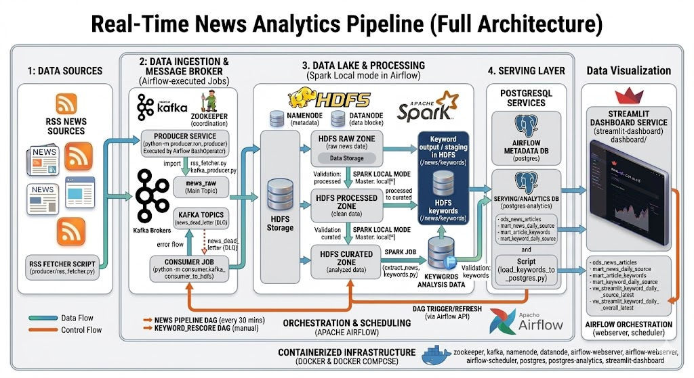

# Real-Time News Analytics Pipeline

Pipeline chính:

`RSS -> Kafka -> HDFS raw -> Spark processed -> Spark curated -> Spark keywords -> PostgreSQL analytics -> Streamlit dashboard`

## Architecture Flow



## Thành viên nhóm
- 3123580051 - Phạm Hoàng Tiến
- 3123580046 - Thạch Ngọc Thảo
- 3123580058 - Nguyễn Thái Tú

Giảng viên hướng dẫn: TS. Vũ Ngọc Thanh Sang

## Yêu cầu môi trường

- Khuyến nghị: `WSL/Linux + Docker Desktop`
- Python chạy trong Linux shell
- Java 17 cho PySpark local
- Docker dùng cho Kafka, HDFS, PostgreSQL, Airflow, Streamlit

## Cấu trúc chính

```text
producer/     RSS fetch + Kafka publish
consumer/     Kafka consume -> HDFS raw
Spark_jobs/   transform, curate, keyword extraction
dashboard/    Streamlit app
dags/         Airflow DAGs
scripts/      validation, loaders, demo, test runner
common/       shared helpers
tests/        unit tests
```

## Quick Start

```bash
python3 -m venv ~/venvs/sgu25_bigdata
source ~/venvs/sgu25_bigdata/bin/activate
python -m pip install --upgrade pip
python -m pip install -r requirements.txt

docker compose up -d
bash scripts/init_kafka_topics.sh
bash scripts/test_pipeline.sh
```

## End-to-End Demo

Lệnh chạy full demo kèm analytics load:

```bash
python -m scripts.run_end_to_end
```

## Verify

Lệnh test chuẩn:

```bash
python -m scripts.run_tests
```

Nếu thiếu dependency test, cài:

```bash
python -m pip install -r requirements.txt -r requirements-dashboard.txt
```

## Chạy thủ công

```bash
python -m producer.run_producer
python -m consumer.kafka_consumer_to_hdfs --max-messages 50
python -m Spark_jobs.transform_news_raw_to_processed --input-path /news/raw --output-path /news/processed
python -m scripts.validate_processed_output --path /news/processed
python -m Spark_jobs.curate_news_processed_to_curated --input-path /news/processed --output-path /news/curated
python -m scripts.validate_curated_output --path /news/curated
python -m Spark_jobs.extract_news_keywords --input-path /news/curated --output-path /news/keywords
python -m scripts.validate_keyword_output --path /news/keywords
python -m scripts.load_curated_to_postgres --input-path /news/curated
python -m scripts.load_keywords_to_postgres --input-path /news/keywords
```

## Airflow

```bash
bash scripts/start_airflow.sh
```

- UI: `http://localhost:8080`
- Username: `airflow`
- Password: `airflow`
- DAGs: `news_pipeline`, `keyword_rescore_pipeline`

## Dashboard

```bash
python -m pip install -r requirements-dashboard.txt
streamlit run dashboard/streamlit_app.py
```

Mặc định dashboard đọc từ PostgreSQL analytics:

- `ANALYTICS_DB_HOST=localhost`
- `ANALYTICS_DB_PORT=5433`
- `ANALYTICS_DB_NAME=analytics`
- `ANALYTICS_DB_USER=analytics`
- `ANALYTICS_DB_PASSWORD=analytics`

Refresh Airflow chỉ bật khi có:

- `AIRFLOW_API_URL`
- `AIRFLOW_USERNAME`
- `AIRFLOW_PASSWORD`

## Port chính

- Kafka: `localhost:9093`
- NameNode UI: `localhost:9870`
- NameNode RPC: `localhost:9000`
- PostgreSQL analytics: `localhost:5433`
- Airflow UI: `localhost:8080`
- Streamlit UI: `localhost:8501`

## Tài liệu liên quan

- `docs/data_contract.md`
- `docs/data_architecture_diagram.svg`
- `docs/project_architecture.svg`
- `sql/analytics_init.sql`
